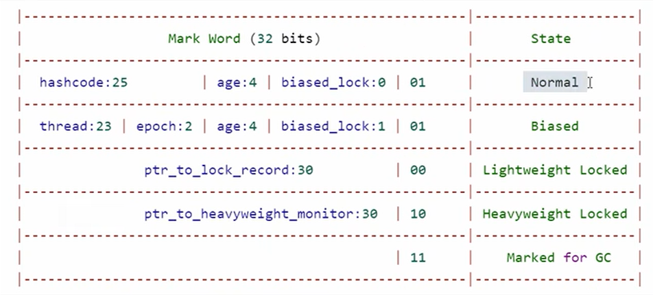

###### video_url:https://www.bilibili.com/video/BV16J411h7Rd/?p=3&spm_id_from=pageDriver&vd_source=b60fb1a1a8f06e334bf9ca2665cdd202

### 同步和异步
    调用方，和被调用方，在调用时，是否需要等待，判断是否为同步
    调用被调用方时，调用方需要等待，就是同步
    调用被调用方时，调用方不需要等待，就是异步
### windows 查看进程线程的方法
    tasklist 查看进程
    tasklist | findstr java 查找java进程
    taskkill 杀死进程
    taskkill /F /PID 33600 强制杀死进程编号33600
### linux 查看进程线程的方法
    ps -fe | grep java 查看java进程
    jps 查看java进程
    kill pid 杀死进程
    top 动态查看进程
    top -H -p pid 查看pid的线程情况
    jstack pid java自带的查看线程信息
### jconsole 查看进程线程
    可以查看远程java程序
### yield
    yield 让出CPU时间，从Running到Runnable状态
### 同步相关方法
    t1.join t1执行完，调用方继续执行
### interrupt
    t1.interrupt() 打断 sleep，wait, join, t1.isInterrupted()为false
    只有当前线程能获取自己是否被打断，用于停止自己的程序，并不是来表示当前线程的状态（表示是否要停止）
    另外一个停止方法 stop()杀死线程，如果这个线程持有锁，那么没有机会释放锁，所以这个方法废弃了
    t1.interrupt() 还可以打断LockSupport.park(),打断后他t1.isInterrupted()为true，不能够再次park，需要从新设置打断标记
### 几个不推荐的方法,锁没法释放
    stop() 停止线程
    suspend() 暂停线程
    resume() 恢复线程
### 应用之统筹
```java
@Slf4j()
class Solution{
    public static void main(String[] args) {
        Thread t1 = new Thread(() -> {
            log.debug("洗水壶");
            sleep(1);
            log.debug("烧开水");
            sleep(15);
        }, "老王");
        Thread t1 = new Thread(() -> {
            log.debug("准备茶叶");
            sleep(1);
        }, "老李");
    }
}
```
### 常见的线程安全类
    调用他们的方法，不需要加锁：他们的每个方法是原子的，注意多个方法组合不是原子的
    String
    Integer
    StringBuffer
    Random
    Vector
    Hashtable
    java.util.concurrent包下的类
### 对象头
#### 普通对象
    Object header 64bits + Mark Word 32bits + Klass Word 32bits
#### 数组对象
    Object header 64bits + Mark Word 32bits + Klass Word 32bits + length 32bits

#### synchronized优化原理-轻量级锁
    多线程访问时间错开，没有竞争，记录一下被占用
    采用cas替换markword信息
    通过线程中的锁记录个数判断重入了几次
    解锁：cas替换markword信息（线程和锁对象）
#### synchronized优化原理-锁膨胀
    申请monitor,object指向重量级锁地址
#### synchronized优化原理-自旋优化
    自旋一定次数，如果还没有获取到锁，才会进入阻塞
#### synchronized优化原理-偏向锁
    markword记录线程id，下次再进来，如果是同一个线程，就不需要cas了
#### synchronized优化原理-偏向锁-状态
    markword倒数第三位记录是否加上偏向锁,默认是1，前面也会记录线程的id
#### synchronized优化原理-锁消除
    JIT对字节码进一步优化，如果锁不会被其他线程访问到，那么就不需要加锁了
#### 小故事 wait notify
    小南工作需要烟，没有烟的时候wait，小明拿来烟的时候notify，小南开始竞争锁
#### wait notify 工作原理
    条件不满足，调用wait，进入wait set，释放锁
    正在竞争锁的处于Blocked，在EntryList中
    notify，或者notifyAll，从wait set中唤醒一个或者全部线程，进入EntryList
#### API
    obj.wait)
    obj.notify() 使用同一个锁的，唤醒一个
    obj.notifyAll()
    这几个方法必须持有锁
#### sleep vs wait
    sleep Thread方法，wait Object方法
    sleep不需要和synchroized配合，wait需要
    sleep不会释放锁，wait会释放锁
#### wait ify 正确姿势
    obj.notify() 只是随机唤醒一个，可以添加另外一个标识
```java
class Code{
    private static Object room = new Object();
    private static boolean haveCigarette = false;
    
    public static void main(String[] args) {
        new Thread(() -> {
            synchronized (room) {
                while (!haveCigarette) {
                    System.out.println("没烟，先歇会");
                    try {
                        room.wait();
                    } catch (InterruptedException e) {
                        e.printStackTrace();
                    }
                }
                if (haveCigarette) {
                    System.out.println("有烟了，可以开始干活了");
                }
            }
        }, "小南").start();
        
        new Thread(() -> {
            synchronized (room) {
                System.out.println("有烟没，有没有，有没有啊");
                haveCigarette = true;
                room.notifyAll();
            }
        }, "小明").start();
    }
}
```
#### 设计模式-保护性暂停
    一个线程等待另一个线程的执行结果
    如果有一个结果需要传递：让他们关联同一个GuardedObject
    如果有源源不断的需要传递，就用消息队列
    JDK中，join、future的实现就是基于这种模式
```java
class GuardedObject {
    private Object response;
    
    public Object getResponse() {
        synchronized (this) {
            while (response == null) {
                try {
                    this.wait();
                } catch (InterruptedException e) {
                    e.printStackTrace();
                }
            }
        }
        return response;
    }
    
    // 升级版，带超时时间
    public Object getResponse(long timeout) {
        synchronized (this) {
            long begin = System.currentTimeMillis();
            long passedTime = 0;
            while (response == null) {
                // 剩余时间
                long waitTime = timeout - passedTime;
                if (waitTime <= 0) {
                    break;
                }
                try {
                    this.wait(waitTime);
                } catch (InterruptedException e) {
                    e.printStackTrace();
                }
                passedTime = System.currentTimeMillis() - begin;
            }
        }
        return response;
    }
    
    public void setResponse(Object response) {
        synchronized (this) {
            this.response = response;
            this.notifyAll();
        }
    }
}
public class GuardedObjectTest {
    public static void main(String[] args) {
        GuardedObject guardedObject = new GuardedObject();
        new Thread(() -> {
            Object response = guardedObject.getResponse();
            System.out.println(response);
        }).start();
        new Thread(() -> {
            guardedObject.setResponse("hello");
        }).start();
    }
}
```
#### 设计模式 join(1000) 原理
    和 wait(1000) 同样，使用的是保护性暂停增强来实现
#### 通过中间类解耦生产和消费
    模拟情景：邮递员把信送到收件人手上
```java
import java.util.Hashtable;

// 带有 id 的GuaredObject
class GuardedObject {
    private int id;
    private Object response;

    public GuardedObject(int id) {
        this.id = id;
    }

    public Object getResponse(long timeout) {
        synchronized (this) {
            long begin = System.currentTimeMillis();
            long passedTime = 0;
            while (response == null) {
                long waitTime = timeout - passedTime;
                if (waitTime <= 0) {
                    break;
                }
                try {
                    this.wait(waitTime);
                } catch (InterruptedException e) {
                    e.printStackTrace();
                }
                passedTime = System.currentTimeMillis() - begin;
            }
        }
        return response;
    }

    public void setResponse(Object response) {
        synchronized (this) {
            this.response = response;
            this.notifyAll();
        }
    }

    public int getId() {
        return id;
    }
}

class Mailboxes {
    private static Map<Integer, GuardedObject> boxes = new Hashtable<>();
    private static int id = 1;

    // 产生唯一 id
    private static synchronized int generateId() {
        return id++;
    }

    public static GuardedObject createGuardedObject() {
        GuardedObject go = new GuardedObject(generateId());
        boxes.put(go.getId(), go);
        return go;
    }
    
    public static GuardedObject getGuardedObject(int id) {
        return boxes.remove(id);
    }

    public static Set<Integer> getIds() {
        return boxes.keySet();
    }
}
class People extends Thread{
    @Override
    public void run() {
        // 收信
        GuardedObject guardedObject = Mailboxes.createGuardedObject();
        System.out.println("开始收信");
        Object mail = guardedObject.getResponse(5000);
        System.out.println("收到信件：" + mail);
    }
    public void send(GuardedObject go, Object message) {
        System.out.println("发送消息：" + message);
        go.setResponse(message);
    }
}
class Postman extends Thread{
    @Override
    public void run() {
        // 送信
        Set<Integer> ids = Mailboxes.getIds();
        if (ids != null) {
            for (Integer id : ids) {
                GuardedObject guardedObject = Mailboxes.getGuardedObject(id);
                String message = "hello, " + id;
                guardedObject.setResponse(message);
            }
        }
    }
}
```
#### 设计模式-生产者消费者模式
    中间通过消息队列进行解耦
#### park & unpark
    暂停当前线程：LockSupport.park()
    唤醒指定线程：LockSupport.unpark(t1)
    park() 与 wait() 的区别
        park() 不需要获取锁
        park() 不会抛出 InterruptedException
        park() 可以响应中断
        park() 可以指定等待时间
        park() 可以先 unpark() 后 park()
#### park & unpark 原理
    每个线程都有自己的Parker对象，由_counter, _cond和_mutex组成
    _counter: 计数器，用于记录unpark的次数
    _cond: 条件变量，用于park线程等待
    _mutex: 互斥锁，用于保护_counter和_cond

#### 多把锁
    把不相关的业务，分别加锁，如睡觉和学习，分别加锁
#### 活跃性
##### 死锁
    互相拿着对方需要的锁
    定位死锁：
    方法一：1.jstack pid 2.能看到死锁日志
    方法二：1.jconsole 2.能看到死锁线程
    哲学家就餐问题：5个哲学家，5个叉子，每个哲学家只能拿到左边的叉子，然后再拿右边的叉子，如果拿不到叉子，就等待
    解决死锁：
    方法一：1.加锁顺序 
##### 活锁
    互相改变对方结束条件的状态
```java
public class LiveLock {
    static volatile int count = 0;
    public static void main(String[] args) {
        new Thread(() -> {
            while (count < 5) {
                System.out.println("t1: " + count);
                count++;
                try {
                    TimeUnit.SECONDS.sleep(1);
                } catch (InterruptedException e) {
                    e.printStackTrace();
                }
            }
        }).start();
        new Thread(() -> {
            while (count > 0) {
                System.out.println("t2: " + count);
                count--;
                try {
                    TimeUnit.SECONDS.sleep(1);
                } catch (InterruptedException e) {
                    e.printStackTrace();
                }
            }
        }).start();
    }
}
```
##### 饥饿
    现成的优先级太低，始终得不到CPU的调度执行
#### ReentrantLock
具备以下特点：
- 可中断 (是指获取不到锁进入阻塞队列后，可以打断其等待的状态)
- 可设置超时时间 (规定时间内，获取不到锁，就返回)
- 可设置为公平锁
- 支持多个条件变量

和 synchronized 一样，支持可重入

```java
import java.util.concurrent.locks.Condition;

class Code {
    public static void main(String[] args) {
        ReentrantLock lock = new ReentrantLock();
        // 基本语法
        lock.lock();
        try {
            // 业务代码
        } finally {
            lock.unlock();
        }

        // 可中断
        try {
            // 如果没有竞争，就获取到lock锁
            // 如果有竞争，就进入阻塞队列，可以被其他线程 interrupt
            lock.lockInterruptibly();
        } catch (InterruptedException e) {
            e.printStackTrace();
            log.debug("没有获得到锁，返回");
        }
        try {
            // 业务代码
        } finally {
            lock.unlock();
        }

        // 可设置超时时间
        if (lock.tryLock(10, TimeUnit.SECONDS)) {
            try {
                // 业务代码
            } finally {
                lock.unlock();
            }
        } else {
            log.debug("没有获得到锁，返回");
        }

        // 公平锁
        ReentrantLock lock = new ReentrantLock(true);

        // 条件变量：根据条件放到不同的waitSet中
        Condition condition1 = lock.newCondition();
        Condition condition2 = lock.newCondition();
        
        lock.lock();
        // 进入休息室等待
        condition1.await();
        // 唤醒休息室的人
        condition1.signal();
        condition1.signalAll();
        lock.unlock();
    }
}
```
##### ReentrantLock 解决哲学家就餐问题
```java
class Code {
    public static void main(String[] args) {
        // 主要代码
        ReentrantLock[] left = new ReentrantLock();
        ReentrantLock[] right = new ReentrantLock();
        while (true) {
            if (left.tryLock()) {
                if (right.tryLock()) {
                    // 业务代码
                    right.unlock();
                }
                left.unlock();
            }
        }
    }
}
```
#### 同步模式之控制顺序
    两个线程分别打印1，2，而且先2后1
```java
// 方法一: synchronized
public class Code {
    static final Object lock = new Object();
    static boolean t2runned = false;
    public static void main(String[] args) {
        new Thread(() -> {
            synchronized (lock) {
                while (!t2runned) {
                    lock.wait();
                }
                System.out.println(1);
            }
        }).start();
        new Thread(() -> {
            synchronized (lock) {
                System.out.println(2);
                t2runned = true;
                lock.notify();
            }
        }).start();
    }
}
// 方法2: 使用 park
class Code {
    static Thread t1 = null;
    static Thread t2 = null;
    public static void main(String[] args) {
        t1 = new Thread(() -> {
            LockSupport.park();
            System.out.println(1);
        });
        t2 = new Thread(() -> {
            System.out.println(2);
            LockSupport.unpark(t1);
        });
        t1.start();
        t2.start();
    }
}
```
#### 设计模式之交替输出

```java
/*
 * 交替输出
 * 输出内容     等待标记    下一个标记
 * a           1            2
 * b           2            3
 * c           3            1
 */
public class Code {
    static final Object lock = new Object();
    static int state = 1;

    public static void main(String[] args) {
        new Thread(() -> {
            synchronized (lock) {
                while (state != 1) {
                    lock.wait();
                }
                System.out.println("a");
                state = 2;
                lock.notifyAll();
            }
        }).start();
        new Thread(() -> {
            synchronized (lock) {
                while (state != 2) {
                    lock.wait();
                }
                System.out.println("b");
                state = 3;
                lock.notifyAll();
            }
        }).start();
        new Thread(() -> {
            synchronized (lock) {
                while (state != 3) {
                    lock.wait();
                }
                System.out.println("c");
                state = 1;
                lock.notifyAll();
            }
        }).start();
    }
}

// 使用条件变量
class Code {
    static final ReentrantLock lock = new ReentrantLock();
    static final Condition a = lock.newCondition();
    static final Condition b = lock.newCondition();
    static final Condition c = lock.newCondition();
    static int state = 1;

    public static void main(String[] args) {
        new Thread(() -> {
            lock.lock();
            try {
                while (state != 1) {
                    a.await();
                }
                System.out.println("a");
                state = 2;
                b.signal();
            } catch (InterruptedException e) {
                e.printStackTrace();
            } finally {
                lock.unlock();
            }
        }).start();
        new Thread(() -> {
            lock.lock();
            try {
                while (state != 2) {
                    b.await();
                }
                System.out.println("b");
                state = 3;
                c.signal();
            } catch (InterruptedException e) {
                e.printStackTrace();
            } finally {
                lock.unlock();
            }
        }).start();
        new Thread(() -> {
            lock.lock();
            try {
                while (state != 3) {
                    c.await();
                }
                System.out.println("c");
                state = 1;
                a.signal();
            } catch (InterruptedException e) {
                e.printStackTrace();
            } finally {
                lock.unlock();
            }
        }).start();
    }
}
// park unpark方式
class Code {
    static Thread t1;
    static Thread t2;
    static Thread t3;
    
    public static void main(String[] args) {
        ParkUnpark pu = new ParkUnpark(5);
        t1 = new Thread(() -> {
            pu.print("a", t2);
        });
        t2 = new Thread(() -> {
            pu.print("b", t3);
        });
        t3 = new Thread(() -> {
            pu.print("c", t1);
        });
        t1.start();
        t2.start();
        t3.start();
        LockSupport.unpark(t1);
    }
}
class ParkUnpark {
    private int loopNumber;
    
    public ParkUnpark(int loopNumber) {
        this.loopNumber = loopNumber;
    }
    
    public void print(String str, Thread next) {
        for (int i = 0; i < loopNumber; i++) {
            LockSupport.park();
            System.out.print(str);
            LockSupport.unpark(next);
        }
    }
}
```
#### volatile-原理-dcl double-checked locking
```java
class Code {
    static volatile Code instance = null;
    public static Code getInstance() {
        if (instance == null) {
            /*
                    synchronized有序性是指，保证多个线程执行代码块依次执行，并不能禁止指令重排序
                    所以对 instance 要加上 volatile
             */
            synchronized (Code.class) {
                if (instance == null) {
                    instance = new Code();
                }
            }
        }
        return instance;
    }
}
```
#### happens-before
    规定了共享变量的写操作对于其他线程的可见性

#### ThreadPoolExecutor
    线程池状态
    RUNNING: 接受新任务并处理阻塞队列中的任务
    SHUTDOWN: 不接受新任务，但处理阻塞队列中的任务
    STOP: 不接受新任务，不处理阻塞队列中的任务，并中断正在执行的任务
    TIDYING: 所有任务都已终止，workerCount为0，线程转换为TIDYING状态
    TERMINATED: terminated()方法被调用后，线程转换为TERMINATED状态
#### Executors 创建的几种常用的线程池
    newFixedThreadPool: 固定大小的线程池, 全是核心线程, 适用于负载比较重的服务器
    newCachedThreadPool: 可缓存的线程池, 全是救济线程, 适用于执行很多短期异步的小程序或者负载较轻的服务器
    newSingleThreadExecutor: 单线程的线程池, 多个任务顺序执行, 适用于需要保证顺序执行各个任务的场景
    newScheduledThreadPool: 定时任务的线程池, 适用于需要多个后台线程执行周期任务的场景
#### 提交任务的方法
    // 执行无返回值的任务
    void execute(Runnable command);
    // 提交任务 task, 用返回值 Future 获得执行结果
    <T> Future<T> submit(Callable<T> task);
    // 提交 tasks 中所有任务
    <T> List<Future<T>> invokeAll(Collection<? extends Callable<T>> tasks);
    // 提交 tasks 中所有任务, 并返回第一个执行完毕的任务的结果
    <T> T invokeAny(Collection<? extends Callable<T>> tasks);
```java
import java.util.concurrent.ExecutorService;
import java.util.concurrent.Executors;
class Code {
    public static void main_invokeAll(String[] args) {
        // invokeAll
        ExecutorService pool = Executors.newFixedThreadPool(2);
        List<Future<String>> futures = pool.invokeAll(Arrays.asList(
            () -> {
                Thread.sleep(900);
                return "1";
            }, 
            () -> {
                Thread.sleep(1000);
                return "2";
            },
            () -> {
                Thread.sleep(1100);
                return "3";
            }
        ));
        futures.forEach(future -> {
            try {
                System.out.println(future.get());
            } catch (InterruptedException | ExecutionException e) {
                e.printStackTrace();
            }
        });
    }

    public static void main_invokeAny(String[] args) {
        ExecutorService pool = Executors.newFixedThreadPool(2);
        try {
            String result = pool.invokeAny(Arrays.asList(
                () -> {
                    Thread.sleep(900);
                    return "1";
                }, 
                () -> {
                    Thread.sleep(1000);
                    return "2";
                },
                () -> {
                    Thread.sleep(1100);
                    return "3";
                }
            ));
            System.out.println(result);
        } catch (InterruptedException | ExecutionException e) {
            e.printStackTrace();
        }
    }
}
```
#### 关闭线程池的方法
    // 关闭线程池, 不再接受新任务, 但会继续执行阻塞队列中的任务
    void shutdown();
    // 关闭线程池, 不再接受新任务, 不再执行阻塞队列中的任务, 并中断正在执行的任务
    List<Runnable> shutdownNow();
    // 等待线程池中的任务执行完毕, 并关闭线程池
    boolean awaitTermination(long timeout, TimeUnit unit);
#### 设计模式-工作线程
    饥饿：固定大小线程会有饥饿现象
#### 创建多少线程数合适
##### CPU 密集型运算
    通常采用 cpu核数 + 1，+1 保证页缺失或者其他原因导致暂停时，这个线程能够顶上去
##### IO 密集型运算
    CPU 不总是处于繁忙状态，当远程RPC、调用数据库时，CPU就闲下来了，这时候就要用多线程提高cpu利用率
    经验公式如下：
        线程数 = 核数 * 期望CPU利用率 * 总时间（CPU计算时间+等待时间）/ CPU计算时间
    例如 4 核CPU计算时间 50%，其他等待时间是 50%，期望cpu被 100% 利用，套用公式
    4 * 100% * 100% / 50% = 8
    一般期望 CPU 利用率 100%, 简化公式如下：
        线程数 = 核数 * (总时间 / CPU计算时间)
#### 定时执行 SecheduledExecutorService
    scheduleAtFixedRate: 固定频率执行
    scheduleWithFixedDelay: 固定延迟执行
```java
import java.util.concurrent.Executors;
import java.util.concurrent.ScheduledExecutorService;
import java.util.concurrent.TimeUnit;
class Code {
    public static void main(String[] args) {
        ScheduledExecutorService pool = Executors.newScheduledThreadPool(2);
        pool.scheduleAtFixedRate(() -> {
            System.out.println("scheduleAtFixedRate");
        }, 0, 1, TimeUnit.SECONDS);
        pool.scheduleWithFixedDelay(() -> {
            System.out.println("scheduleWithFixedDelay");
        }, 0, 1, TimeUnit.SECONDS);
    }
}
```
#### 正确处理线程池的异常
    1. 任务里边自己try catch，线程内抛异常不会有日志
    2. 使用 Callable submit() 方法，如果没有正常日执行，通过 get 方法能获取到异常
#### Fork/Join 线程池
    分治思想，将大任务分解成小任务，小任务执行完毕后，再合并结果
```java
import java.util.concurrent.ForkJoinPool;
class TestForkJoin {
public static void main(String[] args) {
        ForkJoinPool pool = new ForkJoinPool();
        pool.invoke(new MyTask(1, 100));
    }
}

// 1~n 之间整数的和
class MyTask extends RecursiveTask<Integer> {
    private int n;
    public MyTask(int n) {
        this.n = n;
    }
    @Override
    protected Integer compute() {
        if (n == 1) {
            return 1;
        }
        MyTask task = new MyTask(n - 1);
        // 异步执行
        task.fork();
        // n + 获取的结果
        return n + task.join();
    }
}
// 1~n 之间整数的和 方式二：拆成多个任务
class MyTask extends RecursiveTask<Integer> {
    private int begin;
    private int end;
    public MyTask(int begin, int end) {
        this.begin = begin;
        this.end = end;
    }
    @Override
    protected Integer compute() {
        if (end - begin <= 2) {
            int sum = 0;
            for (int i = begin; i <= end; i++) {
                sum += i;
            }
            return sum;
        }
        int mid = (begin + end) / 2;
        MyTask task1 = new MyTask(begin, mid);
        MyTask task2 = new MyTask(mid + 1, end);
        // 异步执行
        task1.fork();
        task2.fork();
        // 获取结果
        return task1.join() + task2.join();
    }
}
```
#### JUC 下的工具包
##### AQS 原理
    其他工具类都是基于 AQS 实现的
    AbstractQueuedSynchronizer 阻塞式锁
    state: 状态,分为独占模式和共享模式
    提供了FIFO等待队列，类似Monitor的EntryList
    条件变量来实现等待、唤醒机制，支持多个条件变量，类似Monitor的WaitSet
```java
// 获取锁的方法
    // 如果获取锁失败
    if (!tryAcquire(arg)) {
        // 入队，可以选择阻塞当前线程
    }
// 释放锁的方法
    // 如果释放锁成功
    if (tryRelease(arg)) {
        // 让阻塞线程回复运行
    }
```
##### aqs-自定义锁（不可重入锁）

```java
import java.util.concurrent.locks.AbstractQueuedSynchronizer;
import java.util.concurrent.locks.Lock;

class MyLock implements Lock {
    private Mysync sync = new MySync();
    @Override
    public void lock() {
        sync.acquire(1);
    }
    @Override
    public void unlock() {
        sync.release(1);
    }
    private static class MySync extends AbstractQueuedSynchronizer {
        @Override
        protected boolean tryAcquire(int arg) {
            // CAS
            if (compareAndSetState(0, 1)) {
                // 设置当前线程为独占线程
                setExclusiveOwnerThread(Thread.currentThread());
                return true;
            }
            return false;
        }
        @Override
        protected boolean tryRelease(int arg) {
            setState(0);
            setExclusiveOwnerThread(null);
            return true;
        }
    }
}
```
##### ReentrantLock 原理
    可重入锁
    重入锁的实现原理是通过一个计数器来实现的，每当一个线程获取到锁之后，计数器的值就会加1，每当线程释放锁的时候，计数器的值就会减1，当计数器的值为0的时候，锁就被释放了。
    重入锁的实现原理是通过一个计数器来实现的，每当一个线程获取到锁之后，计数器的值就会加1，每当线程释放锁的时候，计数器的值就会减1，当计数器的值为0的时候，锁就被释放了。
##### RentrantReadWriteLock
    读写锁
    读锁是共享锁，写锁是独占锁
    读锁和读锁之间不互斥，读锁和写锁之间互斥，写锁和写锁之间互斥
    读锁的实现原理是通过一个计数器来实现的，每当一个线程获取到读锁之后，计数器的值就会加1，每当线程释放读锁的时候，计数器的值就会减1，当计数器的值为0的时候，锁就被释放了。
    写锁的实现原理是通过一个CAS操作来实现的，当一个线程获取到写锁之后，会将state的值设置为-1，当线程释放写锁的时候，会将state的值设置为0。
##### StampedLock 为了进一步优化读性能，特点在读、写的时候都必须加一个戳
##### Semaphore 信号量，用来限制共享资源的线程上限
##### CountDownLatch 数值减到0的时候，唤醒线程

```java
import java.lang.reflect.Array;
import java.util.Random;
import java.util.concurrent.CountDownLatch;
import java.util.concurrent.ExecutorService;
import java.util.concurrent.Executors;

public class CountDownLatchDemo {
    public static void main_01(String[] args) throws InterruptedException {
        CountDownLatch countDownLatch = new CountDownLatch(6);
        for (int i = 1; i <= 6; i++) {
            new Thread(() -> {
                System.out.println(Thread.currentThread().getName() + "\t 国，被灭");
                countDownLatch.countDown();
            }, CountryEnum.forEach_CountryEnum(i).getRetMessage()).start();
        }
        countDownLatch.await();
        System.out.println(Thread.currentThread().getName() + "\t 秦国，一统华夏");
    }

    private static void closeDoor() throws InterruptedException {
        CountDownLatch countDownLatch = new CountDownLatch(6);
        for (int i = 1; i <= 6; i++) {
            new Thread(() -> {
                System.out.println(Thread.currentThread().getName() + "\t 上完自习，离开教室");
                countDownLatch.countDown();
            }, String.valueOf(i)).start();
        }
        countDownLatch.await();
        System.out.println(Thread.currentThread().getName() + "\t 班长最后关门走人");
    }

    // countDownLatch 配合线程池使用
    public static void main_02(String[] args) {
        CountDownLatch latch = Executors.newFixedThreadPool(5);
        for (int i = 1; i <= 6; i++) {
            new Thread(() -> {
                System.out.println(Thread.currentThread().getName() + "\t 国，被灭");
                latch.countDown();
            }, CountryEnum.forEach_CountryEnum(i).getRetMessage()).start();
        }
        try {
            // 等待所有线程执行结束
            latch.await();
        } catch (InterruptedException e) {
            e.printStackTrace();
        }
    }

    // 应用：模拟王者荣耀十个人都加载完毕，开始游戏
    public static void main_03(String[] args) {
        ExecutorService service = Executors.newFixedThreadPool(10);
        CountDownLatch latch = new CountDownLatch(10);
        Random random = new Random();
        String[] all = new String[10];
        for (int i = 0; i < 10; i++) {
            int k = i;
            for (int j = 0; j <= 100; j++) {
                service.submit(() -> {
                    try {
                        Thread.sleep(random.nextInt(100));
                    } catch (InterruptedException e) {
                        e.printStackTrace();
                    }
                    all[i] = j + "%";
                    System.out.print("\r" + Arrays.toString(all));
                    latch.countDown();
                });
            }
        }
        latch.await();
        System.out.println("\n开始游戏");
        service.shutdown();
    }
    // 需要返回结果的就用 Future, 不需要返回结果的就用 CountDownLatch
}
```
##### CyclicBarrier 循环栅栏，可以循环使用
    CountDownLatch 一次性的，CyclicBarrier 可以循环使用
```java
import java.util.concurrent.BrokenBarrierException;
import java.util.concurrent.CyclicBarrier;
class TestCyclicBarrier {
    public static void main(String[] args) {
        // 线程数要和栅栏数一致
        CyclicBarrier cyclicBarrier = new CyclicBarrier(7, () -> {
            // 7个人都到齐了，就可以召唤神龙
            System.out.println("召唤神龙");
        });
        for (int i = 1; i <= 7; i++) {
            final int tempInt = i;
            new Thread(() -> {
                System.out.println(Thread.currentThread().getName() + "\t 收集到第：" + tempInt + "颗龙珠");
                try {
                    cyclicBarrier.await();
                } catch (InterruptedException e) {
                    e.printStackTrace();
                } catch (BrokenBarrierException e) {
                    e.printStackTrace();
                }
            }, String.valueOf(i)).start();
        }
    }
}
```
#### 线程安全的集合类
##### 遗留的安全集合类
##### 修饰的安全集合类
##### JUC安全集合类
    Blocking 大部分基于锁
    CopyOnWrite 大部分基于CAS
    Concurrent 采用cas优化，分段加锁
##### ConcurrentHashMap
    每个方法调用是安全的，但方法组合起来不一定是安全的
##### ConcurrentHashMap 源码
##### ConcurrentHashMap 原理及源码
##### LinkedBlockingQueue
##### ConcurrentLinkedQueue
    
    
    
    


    

    