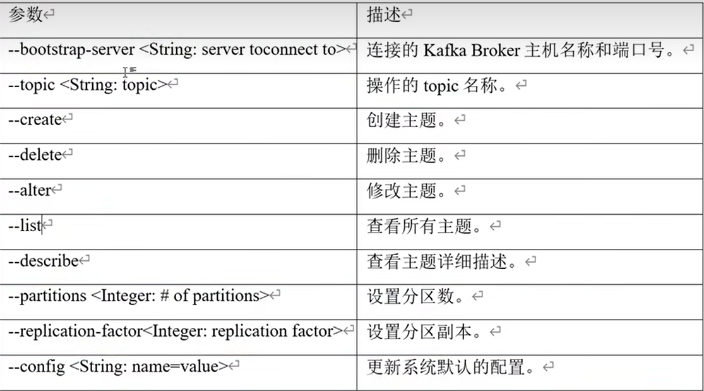

###### video_url:https://www.bilibili.com/video/BV1vr4y1677k?p=1
##### 消息队列两种模式
- 点对点模式：消费者主动从消息队列中拉取消息
- 发布/订阅模式：消费者订阅消息队列，消息队列将消息推送给消费者
##### kafka 基础架构
- kafka 集群由多个 broker 组成


    数据量大的时候，将多个数据分片 partition 存储在不同的 broker 上
- 消费者组 consumer group


    消费者组中的消费者共同消费一个 topic 的数据，提高消费效率
- 副本


    为了保证数据的可靠性，kafka 会将数据复制到其他 broker 上
    副本分为 leader 副本和 follower 副本
    消费、生产者都是和 leader 副本进行交互
- zookeeper


    记录 broker 的信息、副本 leader信息
##### kafka 的操作
topic 的操作

```bash
# 创建 topic
kafka-topics.sh --bootstrap-server hadoop102:9092 --topic first --create --partitions 3 --replication-factor 2
# 查看 topic 详情
kafka-topics.sh --bootstrap-server hadoop102:9092 --topic first --desribe
```
生产者的操作
```bash
# 发送数据
kafka-console-producer.sh --bootstramp-server hadoop102:9092 --topic first
```
消费者的操作
```bash
# 消费数据
kafka-console-consumer.sh --bootstrap-server hadoop102:9092 --topic first --from-beginning
```
#### kafka 生产者_原理
##### 数据发送流程
    main-线程
    Interceptors 拦截器：对数据做一些格式化、过滤等操作
    Serializer 序列化器：将数据序列化为字节数组，不用 java 自带的序列化方式，因为 java 自带的序列化方式不够高效
    Partitioner 分区器：将数据发送到指定的分区
    sender 线程：将数据发送到 broker
    acks 线程：等待 broker 的 ack
##### acks 参数
- acks=0：生产者不等待 broker 的 ack，可能会丢失数据
- acks=1：生产者等待 leader 副本的 ack，可能会丢失数据
- acks=all：生产者等待所有副本的 ack，不会丢失数据
##### 数据发送失败
- 重试机制：默认情况下，是 int 的最大值，即不会停止重试
##### 实操
```java
class Code{
    public static void main(String[] args) {
        // 配置
        Properties props = new Properties();
        props.put(ProducerConfig.BOOTSTRAP_SERVERS_CONFIG, "hadoop102:9092");
        props.put(ProducerConfig.KEY_SERIALIZER_CLASS_CONFIG, StringSerializer.class.getName());
        props.put(ProducerConfig.VALUE_SERIALIZER_CLASS_CONFIG, StringSerializer.class.getName());
        // 创建生产者对象
        KafkaProducer<String, String> producer = new KafkaProducer<>(props);
        // 发送数据
        for (int i = 0; i < 10; i++) {
            // 异步发送
            producer.send(new ProducerRecord<>("first", "hello" + i), new Callback() {
                @Override
                public void onCompletion(RecordMetadata metadata, Exception exception) {
                    if (exception == null) {
                        System.out.println("主题：" + metadata.topic() +
                                            "分区：" + metadata.partition() + 
                                            " - " + metadata.offset());
                    } else {
                        exception.printStackTrace();
                    }
                }
                
            });
            // 同步发送：一批数据发送完之后才会发送下一批数据
            producer.send(new ProducerRecord<>("first", "hello" + i)).get();
        }
        // 关闭资源
        producer.close();
    }
}
```
##### 分区策略
    指明 partition 的情况下，直接放入该分区
    没有指明 partition 的情况下，根据 key 的 hash 值决定放入哪个分区
    没有指明 partition，也没有 key 的情况下，随机放一个分区
##### 数据的可靠性
    ack=0：生产者不等待 broker 的 ack，可能会丢失数据
    ack=1：生产者等待 leader 副本的 ack，可能会丢失数据
    ack=all：生产者等待所有副本的 ack，不会丢失数据
    问题：如果 ack=all，当所有副本都同步完数据，正当 ack 时，leader 副本挂了，会有什么问题？
    答案：leader 挂了，那么就选出新的 leader，producer 没收到 ack，就重试，那么就会有重复数据
##### 幂等性
    重复数据判断标准：<PID, Partition, SeqNumber> 进程id、分区、序号，只能保证单分区单会话内不重复
    仍然存在的问题：如果重启，还是会有重复数据
##### 事务
    自定义 transactional.id，即使客户端挂掉，重启后也能继续处理未处理完成的事务
##### 如何保证数据有序
    1. 同一个分区内的数据有序
        默认：发送数据，如果无响应，可以发送下一个数据，最多 5 次，如果还是无响应，就会报错
        解决：设置 max.in.flight.requests.per.connection=1，发送数据，如果无响应，就不会发送下一个数据，那么单分区就有序
        解决：1.x后，开启幂等性，单分区就有序，因为幂等性是基于 <PID, Partition, SeqNumber> 的，seqNumber 是递增的，保证了有序
    2. 不同分区的数据无序
    


