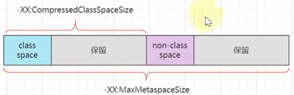

# java 基础
##### == 和 equals 的区别
    == 和 equals 都是比较栈里边的数据，基本类型直接放在栈里边，就是比较的值
    引用类型在栈里边放的是地址，就是比较的地址
    equals一般要重写，比较对象的内容
##### String, StringBuffer, StringBuilder 的区别？
    String 是不可变的
    StringBuffer 是线程安全的
    StringBuilder 是线程不安全的
    优先使用 StringBuilder, 一般方法里边的为局部变量，不涉及多线程
##### Integer 的特性？
    Integer i = 100; 实际上是 Integer i = Integer.valueOf(100);
    Integer 缓存了 -128~127 的值
    Integer 和 int 比较，会自动拆箱，比较的是值
##### Hashtable, HashMap, ConcurrentHashMap 的区别？
    HashMap 是线程不安全的
    Hashtable 是线程安全的
    ConcurrentHashMap 是线程安全的
##### HashMap 的底层实现？
    数组 + 链表、红黑树
    length = 2^n
    put 的过程：通过 hashcode % length = hashcode & (length - 1),计算下标，然后看是否有值
    没值就放当前位置，有值，是链表就依次比较，key相同就覆盖，不同就放到链表最后边
    如果是红黑树，就比较 key 的 hashcode，小的放左边，大的放右边
    如果链表长度超过 8 ，先扩容，直到数组长度为 64，然后把链表转成红黑树
    退化条件：红黑树节点小于 6，会退化
##### HashMap 1.7 和 1.8 的区别？
    7 头插法，8 尾插法
    7 数组 + 链表，8 数组 + 链表 + 红黑树
    7 数组有空位不会扩容
##### 多线程下 HashMap 的安全问题？
    1.7 数组 + 链表，头插法多线程下会出现环形链表，导致死循环； 
    1.7 1.8 都有有可能丢失数据，同时判断为空，各自放元素，只保留一个
##### ConcurrentHashMap 如何实现多线程安全的？
    采用了分段加锁的机制，以数组里的链表为加锁单位，多线程在不同分段加锁，不会产生冲突，效率就比较高
##### 线程的状态

##### 线程的创建方式？
    1. 继承 Thread 类
    2. 实现 Runnable 接口
    3. 实现 Callable 接口
    这些其实都是 Thread 一种，Runnable 接口类传入 Thread ，在 Thread run方法调用了方法
    Callable 也是一样，只不过将返回值放到 FutureTask 的一个属性，线程执行完，通过 get 方法获取
    4. 通过线程池获取
##### 线程池的参数？
    核心线程数：当 正在运行的线程数 < 核心线程数 时，创建新的线程
    阻塞队列：当 正在运行的线程数 > 核心线程数 时，往阻塞队里边放
    最大线程数：当阻塞队列满了，开启新的线程
    拒绝策略：当最大线程数也满了，就执行拒绝策略
    休眠时间：如果没有新的任务进来，超过休眠时间，就终止线程
##### volatitle 阻止指令重排序
    比如：两个变量的赋值顺序
    先给 voltile 变量赋值，再给普通变量赋值
    先读取 voltile 变量，再读取普通变量
    

# 数据库
##### 事务的隔离级别？
    1. 读未提交：会出现脏读的情况
    2. 读已提交 RC：出现不可重复读
    3. 可重复读 RR：在2的基础上，要么读快照，要么对记录加锁，但还是会在列上出现幻读
    4. 串行化：不会出现幻读
##### 事务的四大特性？
    1. A 原子性：靠undo log实现
    2. C 一致性：靠其他几个特性实现
    3. I 隔离性：靠MVCC实现
    4. D 持久性：靠redo log实现
##### mysql 使用的索引数据结构？
    InnoDB用的是 B+ 树，索引和数据存放在一个文件，叶子节点上存数据，并且使用双向链表连接，非叶子节点不存数据
    MyISAM用的是 B+ 树，索引和数据存放在两个文件
##### mysql explain？
    type：表示连接类型，如ALL、index、range、ref、eq_ref、const、system
    All：全表扫描
    index：全索引扫描
    range：索引范围扫描
    ref：非唯一索引扫描 (连接查询时，关联键的数据不是一条)
    eq_ref：唯一索引扫描 (连接查询时，关联键的数据是一条)
    const：主键索引扫描

# spring
##### spring 的数据传播行为？
    1. REQUIRED：如果当前存在事务，则加入该事务；如果没有则创建一个
    2. REQUIRED_NEW：创建一个新的事务，如果存在事务，则挂起当前事务
    3. NESTED：如果存在事务，则嵌套在当前事；如果没有则创建一个
##### REQUIRED 和 NESTED 的区别？
    REQUIRED：被调用方法抛出异常，无论是否捕获，都会导致方法回滚
    NESTED：被调用方法抛出异常，如果被捕获，调用方法不会回滚
##### spring 事务失效场景及原因？
    1. spring 事务对检查异常不能回滚，只能对 RuntimeException 和 Error 回滚
    解决：在方法上加上 @Transactional(rollbackFor = Exception.class)
    2. 对方法内部的异常 try catch 无法回滚
    解决：try catch 之后抛出异常，或 setRollbackOnly()
    3. 自定义切面，try catch, @Transactional 在自定义切面外边，无法回滚
    解决：同上；或调整自定义切面和 事务切面的顺序，切面方法上 @Order(Ordered.LOWEST_PRECEDENCE-1)
    4. 事务注解 要加在 public 方法上，否则无法回滚
    解决：改成 public 方法
    6. 本类方法调用
    解决：自己注入自己
    8. 锁失效
    解决：锁范围增大，锁住事务提交
##### 说说对 spring IOC 的理解？
    首先，IOC 是一个容器，负责管理 bean 的创建、销毁、依赖注入
    使用对象的时候，从容其中获取即可，不需要创建
##### bean 的生命周期？
    1. 实例化
    2. 属性赋值
    3. 织入 aware
    4. 初始化前
    5. 初始化
    6. 初始化后，也是在此时返回的代理对象
##### spring 如何解决循环依赖？
    循环依赖产生的原因，一个对象创建过程中，属性填充另外一个对象，
    而另外一个对象还没有创建，那么就创建另外一个对象，创建这个对象的过程中，
    发现属性又要填充原来那个对象，然而那个独享还没有创建完毕，
    所以就会产生一直循环的问题
    解决: 需要属性的时候，去创建对象，填充属性之前，已经实例化了，只是没有填充属性
    返回这个不完整的对象就可以了，但是这个对象不是代理对象，所以要提前走一下动态代理
    返回这个代理对象
##### AOP 的应用？
    1. 日志
    2. 事务
##### springmvc 执行流程
    1. 请求到达 DispatcherServlet
    2. DispatcherServlet 根据请求信息，找到对应的 HandlerMapping
    3. HandlerMapping 找到对应的 Handler
    4. HandlerAdapter 执行 Handler
    5. HandlerAdapter 执行完 Handler，返回 ModelAndView
    6. ModelAndView 交给 ViewResolver
    7. ViewResolver 找到对应的 View
    8. View 渲染

# mybatis
##### mybatis #{} 和 ${} 的区别？
    #{} 会进行预编译，防止 sql 注入
    ${} 直接拼接字符串，可能会导致 sql 注入
##### mybatis 的缓存？
    一级缓存：默认开启，sqlSession级别的缓存，同一个sqlSession中，相同sql只查一次
    二级缓存：需要手动开启，mapper级别的缓存，同一个mapper中，相同sql只查一次
    先查二级缓存，再查一级缓存，最后查数据库
    查过后，先放一级缓存，再放二级缓存

# JVM
##### JVM 的内存结构？
    1. 方法区：存储类信息、常量、静态变量等
    2. 堆：存储对象
    3. 虚拟机栈：局部变量、操作数栈、动态链接、方法出口等
    4. 本地方法栈：本地方法使用的内存
    5. 程序计数器：当前线程执行的字节码行号
##### 方法区与永久代、元空间之间的关系
    方法区：存储类信息、常量、静态变量等
    方法区一个概念
    永久代是 1.8 之前的实现
    元空间是 1.8 之后的实现，使用本地内存
##### JVM 内存参数

    -XX:MaxNewSize=10m：新生代最大值
    -XX:NewSize=10m：新生代初始值
    -Xmn:10m：新生代固定为 10m
    
    -Xms:20m：新生代和老年代总和初始值
    -Xmx:20m：新生代和老年代总和最大值

##### 类的加载过程？
    1. 加载：将类的 .class 文件加载到内存
    2. 链接-验证：验证文件格式是否符合 java 规范
    3. 链接-准备：为属性分配内存，并设置默认值（非引用对象 final 属性直接赋值）
    4. 链接-解析：将符号引用转为直接引用
    5. 初始化：属性赋值
##### 堆的内存分配？
    1. 新生代：eden、s0、s1
    2. 老年代
##### 怎么判断是垃圾的？
    引用计数法：判断当前对象引用的个数，判断是否是垃圾，但是有循环引用的问题
    可达性分析法：从 GC Root 开始，能够访问到的就是有用对象
##### GC Root 有哪些？
    一般创建的对象都是 GC root
    像 方法里边的局部变量，对象的属性，静态属性，常量等等
##### 垃圾回收算法？
    1. 标记清除：标记出垃圾，清除垃圾
    2. 标记整理：在同一块内存标记出垃圾，整理内存
    3. 复制算法：将内存分成两块，将存活的对象复制到另外一块空的内存
##### 垃圾回收算法适用场景？
    1. 标记清除：适用于存活率低的场景，比如年轻代
    2. 标记整理：适用于存活率高的场景，比如老年代
    3. 复制算法：适用于存活率高的场景，比如老年代
##### 分代回收与 GC 规模
    幸存区对象 15 次 GC 后进入老年代（幸存区内存不足或大对象会导致提前晋升）
##### 垃圾回收器？
    1. Parallel GC：新生代使用复制算法，老年代使用标记整理算法 STW
    2. Concurrent Mark Sweep GC：新生代使用复制算法，老年代使用标记清除算法 STW
    3. G1 GC：新生代标记复制 STW; 老年代并发标记，标记时 STW, 回收价高的，复制 STW

    

# 数据结构和算法
##### 数组的经典习题？
    1. 冒泡排序
    2. 选择排序
    3. 插入排序
    4. 希尔排序
    5. 归并排序
    6. 快速排序
    7. 堆排序
##### 链表的经典习题？
    1. 单链表反转
    2. 链表中环的检测
    3. 两个有序的链表合并
    4. 删除链表倒数第 n 个结点
    5. 求链表的中间结点
##### 栈的经典习题？
    1. 有效的括号
    2. 柱状图中最大的矩形
    3. 接雨水
##### 队列的经典习题？
    1. 用两个栈实现队列
    2. 用两个队列实现栈
##### 二叉树的经典习题？
    1. 二叉树的前中后序遍历
    2. 二叉树的层次遍历
    3. 二叉树的最大、最小深度
    4. 二叉树的镜像
    5. 二叉树的最近公共祖先
    

