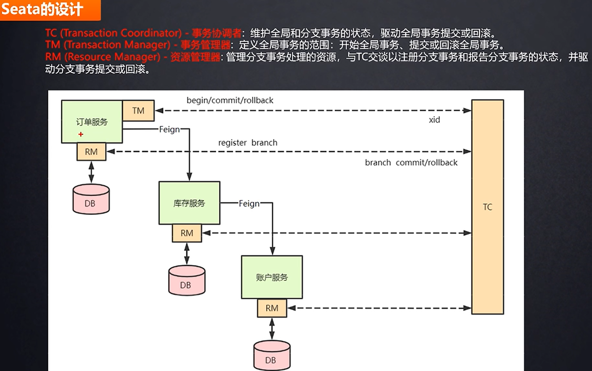

###### vidio_url:https://www.bilibili.com/video/BV1kd4y1m75U/?spm_id_from=333.337.search-card.all.click&vd_source=b60fb1a1a8f06e334bf9ca2665cdd202

# 分布式锁
##### redis 实现分布式锁
    setnx k v, 执行完删除 即可
##### redis 如何防止别的机器删除自己的锁？
    情景：自己设置超时时间过了，还没执行完，别的机器加了锁，自己执行删除锁，把别的锁删了
    判断设置的 v，如果是自己设置的 v，才删除
##### redis 业务代码执行时间超过过期时间，自己的锁失效，别的锁就加上了不应该加的锁
    Redission 就有看门狗机制，每隔 10s 给这个锁续命 30s，直到执行完，删除锁
##### redis 分布式锁优化
    减小锁的粒度，锁更少的代码
    参考 ConcurrentHashMap, 对数据分段加锁
# 分布式事务
##### 2PC Two Phase Commitment Protocol 两阶段提交协议
    1. 准备阶段，所有参与者都执行语句
    2. 提交阶段，所有参与者都执行成功，则通知提交事务，否则回滚
    优点：简单，易于理解
    缺点：单点故障；数据不一致；一直占用连接，直到提交或回滚

    优化了 2PC 的缺点，执行完就直接提交，同时锁上这条数据，如果失败，利用自己记录的 undo log 回滚

##### 3PC Three Phase Commitment Protocol 三阶段提交协议
    解决了 2PC 的单点故障问题,如果长时间没有收到回复，就提交，还是会有数据不一致的问题
    1. CanCommit, 确认数据库环境正常
    2. PreCommit, 执行语句，但不提交
    3. DoCommit, 提交事务/回滚
# 分布式 ID
##### UUID
    占用空间比较大
    无序，索引建立比较慢
    适用场景：数据量不大
##### 自增 ID
    缺点：分库分表情况下，自增 ID 会重复
    解决：统一一张表，每个库都去这张表拿 ID
    缺点：高并发下，性能不好
    解决：多台数据库生成 ID，负载均衡去请求这几个数据库
    美团解决：一次拿 1000 个 ID，然后自己维护一个队列，每次拿一个，用完了再去请求数据库
    美团问题：取 1000 个 ID 的时候，业务请求 ID 响应慢
    美团解决：双 buffer，第一个 1000 ID 没用完的时候，就去取第二个 1000 ID
    适用场景：数据量不大
##### Redis
    同 自增 ID
##### 雪花算法
    1. 41 位的时间戳，精确到毫秒
    2. 10 位的机器标识（可以：5 个机房ID + 5 个机器ID）
    3. 12 位的序列号，同一毫秒内，同一机器，序列号不同
    优点：不依赖数据库，不依赖第三方服务，不依赖网络
    缺点：依赖机器时钟，如果机器时钟回拨，会导致重复 ID
    使用：单独部署，提供 ID 服务，部署多台机器，负载均衡

# CAP 理论，BASE 理论
##### CAP 理论
    一致性 Consistency：对于客户端，所有读到的数据都是最新的；对于服务端，所有写入的数据如何分不到整个系统
    可用性 Availability：某个机器出问题，整个系统还能正常提供服务
    分区容错性 Partition tolerance：网络分区，整个系统还能提供一致性和可用性的服务
##### BASE 理论 是对 CAP 理论的一种妥协
    基本可用 Basic Available：系统在出现不可预知故障的时候，保证基本可用
    软状态 Soft state：允许系统中的数据存在中间状态，而不是一定要有确定的值
    最终一致 Eventually Consistent：系统中所有的数据副本，在经过一段时间后，最终能够达到一致的状态
# Dubbo 的整体架构及分层
##### 五个角色
    注册中心 Registry
    服务提供者 Provider
    服务消费者 Consumer
    监控中心 Monitor：统计服务的调用次数、调用时间
    容器 Container: 服务的运行容器
##### 调用流程
    1. container 容器负责启动、加载、运行provider
    2. provider 启动后，向注册中心注册自己提供的服务
    3. consumer 启动后，向注册中心订阅自己所需的服务
    4. regisitry 返回服务列表给 consumer，如果有变更，会就长链接推送给 consumer
    5. consumer 调用 provider 的服务，基于负载均衡算法进行调用
    6. consumer 调用 provider 的统计，基于短连接定时每分钟统计到 monitor
##### 分层
    接口服务层 Service：面向开发者，业务代码、接口、实现等
    配置层 Config：对外配置接口
    代理层 Proxy：服务代理，生成服务的客户端 stub 和服务器端 skeleton
    服务注册层 Registry：服务注册与发现
    监控层 Monitor：统计服务的调用次数、调用时间
# 分布式寻址算法
##### hash 算法
    取 hash，然后对服务器列表取模，得到服务器的下标
    缺点：不能加减服务器
##### 一致性 hash 算法
    对 0 到 29 首位连成一个环，然后对 3 台服务器列表取 hash，得到服务器的下标
    对数据取 hash 后，对 30 取模，得到数据的下标，然后顺时针找到第一个服务器的下标
    对比 hash 算法，影响的数据只有 1 台服务器的数据，而不是所有的数据
    仍然存在问题：服务器分布不均匀，数据就分布不均匀
    解决：一台服务器对应多个虚拟节点，然后对虚拟节点取 hash，得到虚拟节点的下标
##### hash slot 算法
    hash(key) 取模后 找到对应的 slot，每个 10个 slot 对应一台服务器，和容易增删节点
# 分布式架构下，Session 共享的解决方案
##### 采用无状态服务，抛弃 session
##### 存入 cookie，有安全风险
##### 服务器之间进行 Session 同步
##### IP 绑定策略
    Nginx：通过 ip_hash 策略，把同一个 ip 的请求绑定到同一个服务器
##### 使用 reids 存储
    把 session 放到 redis 中
    优点：session 共享，session 可以跨服务器
#####

    
