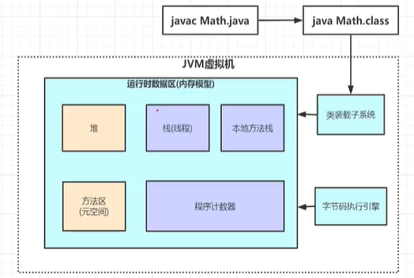

###### vedio_url: https://www.bilibili.com/video/BV1c44y1U7em/?spm_id_from=333.337.search-card.all.click&vd_source=b60fb1a1a8f06e334bf9ca2665cdd202

#### JVM 运行时数据区

#### 栈帧里边有什么
1. 局部变量表
2. 操作数栈
3. 动态链接
4. 方法出口
#### .class文件里边的内容有什么
    可以用 javap -c xxx.class 生成的文件查看
1. 自定义方法的每一步对用的汇编指令
    - int a = 1; 生成的汇编指令
      - iconst_1 // 将 int常量 1 压栈
      - istore_1 // 将 int常量存到变量1
    - int a = 1 + 2; 生成的汇编指令
      - iconst_1 // 将 int常量 1 压栈
      - iconst_2 // 将 int常量 2 压栈
      - iadd // 将栈顶两个 int 常量相加
      - istore_1 // 将 int常量存到变量1
#### jvm调优工具 Arthas
```bash
# 启动 arthas
java -jar arthas-boot.jar
# 选择需要调优的进程
# 查看内存占用， 堆使用情况, 可以看出哪个进程占用了大量 CPU
dashboard
# 查找 2 号进程的哪一行代码的原因
thread 2
# 查找阻塞的代码
thread -b
# 线上运行的代码反编译成 java 代码
jad org.example.P001_JVM.Jvm

```
# jvm 调优的目的
- 降低 full GC 次数
# 为什么要设计 STW 机制
因为由用户线程的存在，导致一些对象是否是垃圾无法确定，所以需要 STW 机制，让用户线程停止，让 GC 线程去判断对象是否是垃圾


